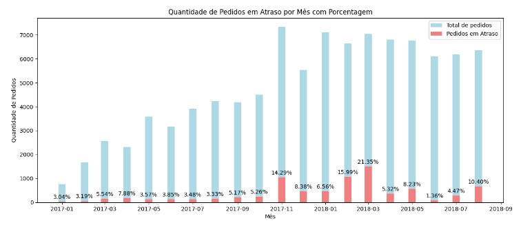
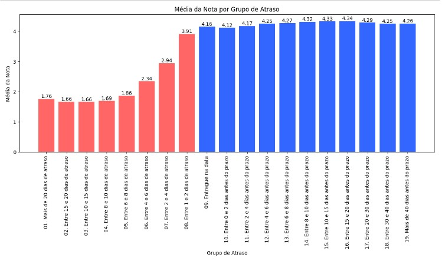

# Comercio brasileiro

## Objetivos:

- Este é um conjunto de dados públicos de comércio eletrônico brasileiro de pedidos feitos em [Loja Olist](https://www.olist.com/) e disponibilizado no [Kaggle](https://www.kaggle.com/datasets/olistbr/brazilian-ecommerce?select=olist_customers_dataset.csv). com esse conjunto de dados é possível fazer várias análises, a que escolhi foi **'há uma necessidade de investimento em uma área de melhoria da experiência do cliente ao ter um atraso na entrega?'**
- O time de logistica não considera que o atraso na entrega é um problema relevante, e falou que em média, as entregas estão sendo feitas com 10 dias antes do prazo estabelecido.
- Não é desejado a previsão de uma entrega atrasada, apenas a exposição do problema.
- A ideia não é "nenhuma entrega pode atrasar", mas se ela atrasar, como podemos melhorar a experiencia do cliente?
- Estes são dados comerciais reais, foram anonimizados e as referências às empresas e parceiros no texto de revisão foram substituídas pelos nomes das grandes casas de Game of Thrones.

## Principais bibliotecas utilizadas:
- Pandas, Numpy, Matplotlib, SQLite3, WordCloud

## Você pode me encontrar:
&nbsp;&nbsp;

## Etapa 1: EDA
- Para facilitar o entendimento e o trabalho com as tabelas, acredito que a melhor solução é criar um banco de dados, para facilitar a validação de dados futuros com o time.
- Logo após selecionarmos a tabela "orders" e fazer o tratamento de dados, verificamos que o time de logística estava certo, e em média, as entregas aconteciam com 10 dias de antecedência.
- Porém, visualizando graficamente, percebemos que cerca de 10% dos clientes tinham pedidos em atraso, sendo 2% deles com atraso superior a 10 dias.
- Verifiquei a quantidade de pedidos por nota e sua relação com preço, e em ambos os casos os dados mostrados não acrescentavam nada à análise.
- Após juntar as tabelas orders e order_review e fazer os tratamentos necessários, foi possível verificar que dentro de um mesmo mês tínhamos pedidos entregues de forma muito rápida e outros que atrasaram consideravelmente, porém em média (e essa informação validada com o time de logística) os pedidos eram entregues antes do prazo.

- Conseguimos verificar que entre 11/2017 e 03/2018 houve 3 meses em que a taxa de atrasos foi superior a 14%, entender com o time de logistica o que pode ter acontecido.

## Etapa 2: Lidando com os pedidos duplicados
- Nessa etapa, já importamos as tabelas 'orders' e 'order_reviews' já filtradas de acordo com nossa consulta em SQL, removendo as linhas que não possuem review, adicionando a coluna 'review_min' que significa considerar a menor nota em pedidos que tiveram mais de uma avaliação considerando um cenário conservador.

- Após os tratamentos, mostramos um gráfico que fica bem claro, pedidos que atrasam em média, tem nota 46% menor que pedidos que não atrasam.
- Agrupando os atrasos em grupos, conseguimos tirar mais informações e percebemos, quanto menor o atraso, em média, maior a nota do cliente.

- E para verificar se as notas baixas eram realmente por causa dos atrasos, criei uma nuvem de palavras para validar as informações, filtrando apenas clientes que tiveram atraso inferior a 10 dias.

# Conclusão.
- Trabalhar com o setor de logistica é um caso a parte, para o cliente, não importa se a empresa, em média, entrega com 10 dias de antecedencia, já que, por exemplo, na experiencia dele foi negativa entregando com 10 dias de atraso, e possivelmente não retornando a ser cliente.
- Foi constatado que cliente que tiveram atraso na entrega avaliaram 46% pior que clientes que receberam antes do prazo.
- Entender porque os meses de 11/2017 e 03/2018 tiveram um maior atraso é muito importante para que o problema não aconteça novamente.
